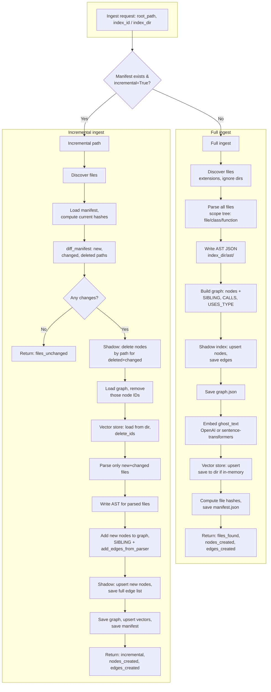
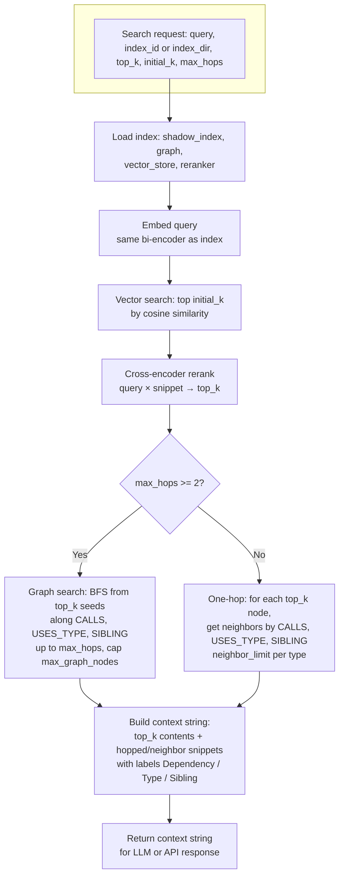

# CCG: Ingestion and Search Flowcharts

## 1. Ingestion process

**Artifacts written**

| Step        | Output |
|------------|--------|
| Parse      | Scope nodes (id, path, type, name, content, ghost_text, calls, uses_types) |
| AST        | `index_dir/ast/<path>.json` (Python, JS, TS, Java) |
| Graph      | `index_dir/graph.json` (nodes + edges) |
| Shadow     | `index_dir/ccg.db` (nodes + edges tables) |
| Vectors    | `index_dir/vectors/` (vectors.npy, vector_ids.json, vector_meta.json) or Qdrant |
| Manifest   | `index_dir/manifest.json` (path → content_hash, root_hash) |

---

## 2. Search process

**Search data flow**

| Stage           | Input                    | Output |
|-----------------|--------------------------|--------|
| Embed           | Query text               | Query vector |
| Vector search   | Query vector, k=initial_k | List of (node_id, score) |
| Rerank          | Query, (node_id, content) pairs | Top top_k (node_id, score) |
| Graph expansion | top_k node IDs, graph    | Neighbor nodes (1-hop or BFS) |
| Context build   | top_k contents + neighbors | Single string (code + // labels) |

---

## 3. Quick reference

- **Ingestion:** Discover → Parse (scope tree) → Graph (nodes + edges) → Shadow index + graph.json → Embed → Vectors + manifest. Incremental uses manifest diff and only re-parses changed files.
- **Search:** Embed query → Vector search (initial_k) → Rerank (top_k) → Graph expansion (1-hop or multi-hop BFS) → Concatenate context string.
